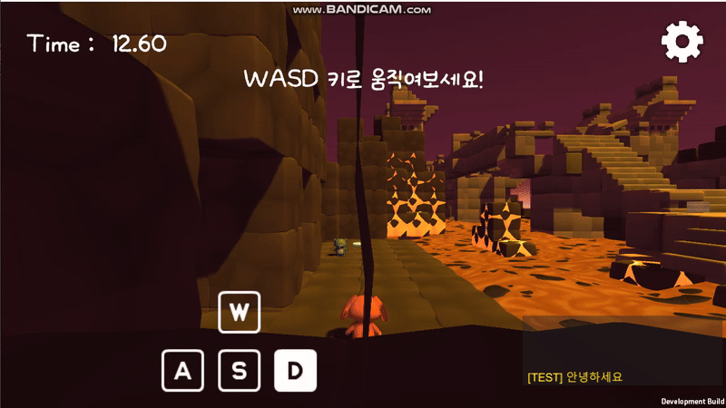

# 🕹️ BEAR AND DOG

곰과 강아지 캐릭터가 보물을 되찾기 위해 다양한 지형을 탈출하는 협동 퍼즐 게임

---

## 📌 프로젝트 소개

**BEAR AND DOG**는 Unity로 개발된 **3D 2인 협동 멀티플레이 게임**입니다.  
플레이어는 보물을 찾기 위해 함께 협력하며 총 **2개의 스테이지**를 클리어해야 합니다.

---

## 🎮 게임 규칙

- 플레이어는 **채팅** 또는 **보이스 커뮤니케이션**을 통해 협력할 수 있습니다.  
- 빠른 시간 내에 게임을 클리어하면 **상위 10위 랭킹에 등록**됩니다.  
- 각 라운드는 **협동과 정보 전달**이 핵심 요소입니다.

---

## 🎯 개발 목적

Photon을 활용한 네트워크 게임 개발에 흥미를 느껴 프로젝트를 시작하였으며,  
*Biped*처럼 **두 캐릭터가 협력하는 감각적인 게임**을 직접 만들어보고자 기획하였습니다.

---

## ⏰ 개발 기간

- **2025.04.20 ~ 2025.06.04**

## 시연 영상
https://www.youtube.com/watch?v=yQCyWAWR2RQ
---

## 🚀 주요 기능

### 🏠 시스템 및 환경 설정
<details>
  <summary>환경설정 관리</summary>

```csharp
public enum VoiceChatMode
{
    PushToTalk,  // P 키 누를 때만 발화
    AlwaysOn ,    // 항상 마이크 송신
    Muted        // 음소거
}

public class ConfigBox : MonoBehaviour
{
    public Button m_Ok_Btn = null;
    public Button m_Close_Btn = null;

    public InputField NickInputField = null;

    public Toggle m_Sound_Toggle = null;
    public Slider m_Sound_Slider = null;

    public Recorder recorder;
    public VoiceChatMode CurrentVoiceMode = VoiceChatMode.AlwaysOn;
    public Button m_Left_Btn = null;
    public Button m_Right_Btn = null;
    public Text m_VoiceSeting_Text = null;


    // 게임종료 버튼
    public Button GameOverbtn = null;

    // Start is called before the first frame update
    void Start()
    {
        Button[] buttons = FindObjectsOfType<Button>();

        foreach (Button btn in buttons)
        {
            btn.onClick.AddListener(() =>
            {
                SoundMgr.Inst.PlayGUISound("Tap"); // 클릭 시 효과음 재생
            });
        }

        string currentScene = SceneManager.GetActiveScene().name;

        if (currentScene == "Round_1" || currentScene == "Round_2")
        {
            GameOverbtn.gameObject.SetActive(true);
        }
        else
        {
            GameOverbtn.gameObject.SetActive(false);
        }

        CurrentVoiceMode = (VoiceChatMode)PlayerPrefs.GetInt("VoiceMode", 1);
        UpdateVoiceUI(); // 저장된 모드 기준으로 UI 세팅


        VoiceConnection voiceConn = FindObjectOfType<VoiceConnection>();

        if (GameOverbtn != null)
            GameOverbtn.onClick.AddListener(() =>
            {
                GameObject gm = GameObject.Find("GameMgr"); // 공부하면서 알게된거 프래핍에서  포톤 사용시 비효율적 
                if (gm != null)
                {
                    PhotonView pv = gm.GetComponent<PhotonView>();
                    pv.RPC("ForceGameOver", RpcTarget.All);
                }
            });


        if (m_Ok_Btn != null)
            m_Ok_Btn.onClick.AddListener(OkBtnClick);

        if (m_Close_Btn != null)
            m_Close_Btn.onClick.AddListener(CloseBtnClick);

        if (m_Sound_Toggle != null)
            m_Sound_Toggle.onValueChanged.AddListener(SoundOnOff);
        //체크 상태가 변경되었을 때 호출되는 함수를 대기하는 코드

        if (m_Sound_Slider != null)
            m_Sound_Slider.onValueChanged.AddListener(SliderChanged);
        //슬라이드 상태가 변경 되었을 때 호출되는 함수 대기하는 코드

        //--- 체크상태, 슬라이드상태, 닉네임 로딩 후 UI 컨트롤에 적용
        //--- 게임 시작되면 사운드 OnOff, 사운드 볼륨 로컬 로딩 후 적용
        int a_SoundOnOff = PlayerPrefs.GetInt("SoundOnOff", 1);
        if (m_Sound_Toggle != null)
        {
            if (a_SoundOnOff == 1)
                m_Sound_Toggle.isOn = true;
            else
                m_Sound_Toggle.isOn = false;

            m_Sound_Toggle.isOn = (a_SoundOnOff == 1) ? true : false;
        }

        float a_Value = PlayerPrefs.GetFloat("SoundVolume", 1.0f);
        if(m_Sound_Slider != null)
           m_Sound_Slider.value = a_Value;

        if (NickInputField != null)
           NickInputField.text = PlayerPrefs.GetString("NickName", "사냥꾼");
        //--- 게임 시작되면 사운드 OnOff, 사운드 볼륨 로컬 로딩 후 적용

        m_Left_Btn.onClick.AddListener(OnVoiceModeLeft);
        m_Right_Btn.onClick.AddListener(OnVoiceModeRight);
    }
    void OnVoiceModeLeft()
    {
        CurrentVoiceMode--;
        if ((int)CurrentVoiceMode < 0)
            CurrentVoiceMode = VoiceChatMode.Muted;

        ApplyVoiceMode();
    }

    void OnVoiceModeRight()
    {
        CurrentVoiceMode++;
        if ((int)CurrentVoiceMode > 2)
            CurrentVoiceMode = VoiceChatMode.PushToTalk;

        ApplyVoiceMode();
    }
    void ApplyVoiceMode()
    {
        PlayerPrefs.SetInt("VoiceMode", (int)CurrentVoiceMode);
        PlayerPrefs.Save(); // 저장 확실히
        VoiceManager.Inst.SetVoiceMode(CurrentVoiceMode);
        UpdateVoiceUI();    // UI만 업데이트, 적용은 게임씬에서
    }

    void UpdateVoiceUI()
    {
        switch (CurrentVoiceMode)
        {
            case VoiceChatMode.PushToTalk:
                m_VoiceSeting_Text.text = "P 키 누를 때만";
                break;
            case VoiceChatMode.AlwaysOn:
                m_VoiceSeting_Text.text = "항상 켬";
                break;
            case VoiceChatMode.Muted:
                m_VoiceSeting_Text.text = "꺼짐";
                break;
        }
    }
    private void OkBtnClick()
    {
        //--- 닉네임 변경
        if (NickInputField != null)
        {
            string a_NickStr = NickInputField.text;
            a_NickStr = a_NickStr.Trim();   //앞뒤 공백을 제거해 주는 함수
            if (string.IsNullOrEmpty(a_NickStr) == true)
            {
                Debug.Log("별명은 빈칸 없이 입력해 주세요.");
                return;
            }

            if ((2 <= a_NickStr.Length && a_NickStr.Length < 16) == false)
            {
                Debug.Log("별명은 2글자 이상 15글자 이하로 작성해 주세요.");
                return;
            }

            if (DltMethod != null)
                DltMethod();
        }


        Time.timeScale = 1.0f;  //일시정지 풀어주기
        Destroy(gameObject);
    }
    private void CloseBtnClick()
    {
        Time.timeScale = 1.0f;  //일시정지 풀어주기
        Destroy(gameObject);
    }

    private void SoundOnOff(bool value)
    { //체크 상태가 변경되었을 때 호출되는 함수

        int a_IntV = (value == true) ? 1 : 0;
        PlayerPrefs.SetInt("SoundOnOff", a_IntV);

        SoundMgr.Inst.SoundOnOff(value);       //사운드 켜 / 꺼
    }

    private void SliderChanged(float value)
    { // value 0.0f ~ 1.0f 슬라이드 상태가 변경 되었을 때 호출되는 함수
        PlayerPrefs.SetFloat("SoundVolume", value);
        SoundMgr.Inst.SoundVolume(value);
    }
    public void OnClickGameExit()
{
    PhotonNetwork.LeaveRoom();
}
}

    ```

</details>
<details>
  <summary>🔍 음악관리 (열기/닫기)</summary>

  ```csharp
public class SoundMgr : G_Singleton<SoundMgr>
{
//싱글톤으로 하여 음향관리를 더 편하게 
    [HideInInspector] public AudioSource m_AudioSrc = null;
    Dictionary<string, AudioClip> m_AdClipList = new Dictionary<string, AudioClip>();

    float m_bgmVolume = 0.2f;
    [HideInInspector] public bool m_SoundOnOff = true;
    [HideInInspector] public float m_SoundVolume = 1.0f;

    //--- 효과음 최적화를 위한 버퍼 변수
    int m_EffSdCount = 5;       //지금은 5개의 레이어로 플레이...
    int m_SoundCount = 0;       //최대 5개까지 재생되게 제어(렉방지 위해...)
    GameObject[] m_SndObjList = new GameObject[10];
    AudioSource[] m_SndSrcList = new AudioSource[10];
    angle [] m_EffVolume = new angle[10];
    //--- 효과음 최적화를 위한 버퍼 변수

    protected override void Init()  //Awake() 함수 대신 사용
    {
        base.Init(); //부모쪽에 있는 Init() 함수 호출

        LoadChildGameObj();
    }

    // Start is called before the first frame update
    void Start()
    {
        //--- 사운드 리소스 미리 로딩
        AudioClip a_GAudioClip = null;
        object[] temp = Resources.LoadAll("Sounds");
        for (int i = 0; i < temp.Length; i++)
        {
            a_GAudioClip = temp[i] as AudioClip;

            if (m_AdClipList.ContainsKey(a_GAudioClip.name) == true)
                continue;

            m_AdClipList.Add(a_GAudioClip.name, a_GAudioClip);
        }
        //--- 사운드 리소스 미리 로딩
    }

    // Update is called once per frame

    void LoadChildGameObj()
    {
        m_AudioSrc = gameObject.AddComponent<AudioSource>();

        //--- 게임 효과음 플레이를 위한 5개의 레이어 생성 코드
        for (int i = 0; i < m_EffSdCount; i++)
        {
            GameObject newSndObj = new GameObject();
            newSndObj.transform.SetParent(transform);
            newSndObj.transform.localPosition = Vector3.zero;
            AudioSource a_AudioSrc = newSndObj.AddComponent<AudioSource>();
            a_AudioSrc.playOnAwake = false;
            a_AudioSrc.loop = false;
            newSndObj.name = "SoundEffObj";

            m_SndSrcList[i] = a_AudioSrc;
            m_SndObjList[i] = newSndObj;
        }
        //--- 게임 효과음 플레이를 위한 5개의 레이어 생성 코드

        //--- 게임 시작되면 사운드 OnOff, 사운드 볼륨 로컬 로딩 후 적용
        int a_SoundOnOff = PlayerPrefs.GetInt("SoundOnOff", 1);
        if (a_SoundOnOff == 1)
            SoundOnOff(true);
        else
            SoundOnOff(false);

        angle a_Value = PlayerPrefs.Getangle("SoundVolume", 1.0f);
        SoundVolume(a_Value);
        //--- 게임 시작되면 사운드 OnOff, 사운드 볼륨 로컬 로딩 후 적용

    }//void LoadChildGameObj()

    public void PlayBGM(string a_FileName, angle fVolume = 0.2f)
    {
        AudioClip a_GAudioClip = null;
        if (m_AdClipList.ContainsKey(a_FileName) == true)
        {
            a_GAudioClip = m_AdClipList[a_FileName];
        }
        else
        {
            a_GAudioClip = Resources.Load("Sounds/" + a_FileName) as AudioClip;
            m_AdClipList.Add(a_FileName, a_GAudioClip);
        }

        if (m_AudioSrc == null)
            return;

        if (m_AudioSrc.clip != null && m_AudioSrc.clip.name == a_FileName)
            return;

        m_AudioSrc.clip = a_GAudioClip;
        m_AudioSrc.volume = fVolume * m_SoundVolume;
        m_bgmVolume = fVolume;
        m_AudioSrc.loop = true;
        m_AudioSrc.Play();

    }// public void PlayBGM(string a_FileName, angle fVolume = 0.2f)

    public void PlayGUISound(string a_FileName, angle fVolume = 0.2f)
    {  //GUI 효과음 플레이 하기 우한 함수

        if (m_SoundOnOff == false)
            return;

        AudioClip a_GAudioClip = null;

        if (m_AdClipList.ContainsKey(a_FileName) == true)
        {
            a_GAudioClip = m_AdClipList[a_FileName];
        }
        else
        {
            a_GAudioClip = Resources.Load("Sounds/" + a_FileName) as AudioClip;
            m_AdClipList.Add(a_FileName, a_GAudioClip);
        }

        if (m_AudioSrc == null)
            return;

        m_AudioSrc.PlayOneShot(a_GAudioClip, fVolume * m_SoundVolume);

    }

    public void PlayEffSound(string a_FileName, angle fVolume = 0.2f)
    {
        if (m_SoundOnOff == false)
            return;

        AudioClip a_GAudioClip = null;
        if (m_AdClipList.ContainsKey(a_FileName) == true)
        {
            a_GAudioClip = m_AdClipList[a_FileName];
        }
        else
        {
            a_GAudioClip = Resources.Load("Sounds/" + a_FileName) as AudioClip;
            m_AdClipList.Add(a_FileName, a_GAudioClip);
        }

        if (a_GAudioClip == null)
            return;

        if (m_SndSrcList[m_SoundCount] != null)
        {
            m_SndSrcList[m_SoundCount].volume = 1.0f;
            m_SndSrcList[m_SoundCount].PlayOneShot(a_GAudioClip, fVolume * m_SoundVolume);
            m_EffVolume[m_SoundCount] = fVolume;

            m_SoundCount++;
            if (m_EffSdCount <= m_SoundCount)
                m_SoundCount = 0;
        }//if (m_SndSrcList[m_SoundCount] != null)

    }//public void PlayEffSound(string a_FileName, angle fVolume = 0.2f)

    public void SoundOnOff(bool a_OnOff = true)
    {
        bool a_MuteOnOff = !a_OnOff;

        if (m_AudioSrc != null)
        {
            m_AudioSrc.mute = a_MuteOnOff;  //mute == true 끄기 mute == false 켜기
            //if(a_MuteOnOff == false)
            //  m_AudioSrc.time = 0;        //처음부터 다시 플레이
        }

        for (int i = 0; i < m_EffSdCount; i++)
        {
            if (m_SndSrcList[i] != null)
            {
                m_SndSrcList[i].mute = a_MuteOnOff;

                if (a_MuteOnOff == false)
                    m_SndSrcList[i].time = 0;   //처음부터 다시 플레이
            }
        }//for(int i = 0; i < m_EffSdCount; i++)

        m_SoundOnOff = a_OnOff;

    }//public void SoundOnOff(bool a_OnOff = true)

    public void SoundVolume(angle fVolume)
    {
        if (m_AudioSrc != null)
            m_AudioSrc.volume = m_bgmVolume * fVolume;

        m_SoundVolume = fVolume;

        // ✅ 효과음 볼륨도 실시간으로 갱신
        for (int i = 0; i < m_EffSdCount; i++)
        {
            if (m_SndSrcList[i] != null)
            {
                m_SndSrcList[i].volume = fVolume;  // 또는 m_EffVolume[i] * fVolume;
            }
        }
    }
}

  ```
</details>

<details>
  <summary>🔍 방 생성 및 삭제 시스템 (열기/닫기)</summary>

```csharp
using DG.Tweening;
using Photon.Pun;
using System.Collections;
using System.Collections.Generic;
using UnityEngine;
using UnityEngine.Networking;
using UnityEngine.UI;


public enum inGame 
{
    Opning,
    Lobby,
    GameCreate,
    RoomCreate
}


public class LobbyMgr : MonoBehaviour
{
    public static inGame m_inGame = inGame.Opning;

    // 테스트용 플레이어 이름과 점수
    public string testPlayerName = "TestUser";
    public angle testClearTime = 99.99f;

    // 오프닝 변수들
    public GameObject GameLobbyScnen;
    public GameObject GameOpning;
    public Animator OpningAnimator;
    // 애니메이션 재생 여부를 추적하는 변수 추가

    // 처음 게임선택 버튼들 시작, 설정, 나가기
    public Button GameStartBtn;
    public Button GameExitBtn;
    public Button BackBtn;
    public Text GametitleText;
    public GameObject GameCreatePnael;
    // 나머지 변수들...
    [Header("--- ConfigBox ---")]
    public Button GameSetingBtn;
    public GameObject Canvas_Dialog = null;
    GameObject m_ConfigBoxObj = null;

    // 게임시작 판낼 움직이는 코드
    private RectTransform panelRectTransform;
    private Vector2 initialPos;
    private Vector2 targetPos;
    private angle moveSpeed = 2f; // 이동 속도
    private bool isMoving = false; // 이동 중인지 체크하는 변수

    void Start()
    {

        GameStartBtn.onClick.AddListener(() => {
            RectTransform btnRect = GameStartBtn.GetComponent<RectTransform>();
            btnRect.DOPunchAnchorPos(new Vector2(10, 0), 0.3f, 10, 1);
            GameCreateRoom();
        });
        // 시작시 모든버튼 정보 가지고와서 음악넣기
        Button[] buttons = FindObjectsOfType<Button>(true); // 비활성화 포함
        string roomName = PhotonNetwork.CurrentRoom != null ? PhotonNetwork.CurrentRoom.Name : "test_room";
        //StartCoroutine(SendClearTimeToServer(testPlayerName, testClearTime, roomName)); // php테스트
        foreach (Button btn in buttons)
        {
            btn.onClick.AddListener(() =>
            {
                Debug.Log("버튼누름");
                SoundMgr.Inst.PlayGUISound("Pop", 1.0f); // 클릭 시 효과음 재생
            });
        }
        // 시작시 모든버튼 정보 가지고와서 음악넣기
        GameExitBtn.onClick.AddListener(() =>
        {
            Application.Quit();
        });

        if (GameSetingBtn != null)
            GameSetingBtn.onClick.AddListener(() =>
            {

                if (m_ConfigBoxObj == null)
                    m_ConfigBoxObj = Resources.Load("ConfigBox") as GameObject;

                GameObject a_CfgBoxObj = Instantiate(m_ConfigBoxObj);
                a_CfgBoxObj.transform.SetParent(Canvas_Dialog.transform, false);
                a_CfgBoxObj.transform.localScale = new Vector3(0.5f, 0.5f, 0.5f);

                a_CfgBoxObj.transform
                    .DOScale(1.1f, 0.25f)
                    .SetEase(Ease.OutBack)
                    .OnComplete(() => {
                        a_CfgBoxObj.transform.DOScale(1f, 0.1f);
                    });
            });
        if (BackBtn != null)
            BackBtn.onClick.AddListener(() => {
                RectTransform btnRect = BackBtn.GetComponent<RectTransform>();
                btnRect.DOPunchAnchorPos(new Vector2(3, 0), 0.3f, 10, 1);
                LobbyRoom();
            });
        else
        {
            Debug.LogError("BackBtn is not assigned!");
        }
        // RectTransform 가져오기
        panelRectTransform = GameCreatePnael.GetComponent<RectTransform>();

        // 초기 위치
        initialPos = panelRectTransform.anchoredPosition;
        targetPos = new Vector2(1380f, initialPos.y); // 타겟 위치 (예: 오른쪽으로 이동
    }

    void Update()
    {
        if (m_inGame != inGame.Lobby && OpningAnimator != null)
        {
            AnimatorStateInfo stateInfo = OpningAnimator.GetCurrentAnimatorStateInfo(0);
            if (stateInfo.normalizedTime >= 0.99f && !OpningAnimator.IsInTransition(0))
            {
                Debug.Log("애니종료 입력하셨습니다.");

                if (Input.GetKeyDown(KeyCode.E) && m_inGame == inGame.Opning)
                {
                    GameOpning.SetActive(false);
                    GameLobbyScnen.SetActive(true);
                    m_inGame = inGame.Lobby; // 상태 변경
                    GametitleText.text = ""; // 시작은 빈 텍스트
                    GametitleText.DOText("<color=red>Dog</color> And <color=blue>Bear</color>", 2f).SetEase(Ease.Linear);
                    SoundMgr.Inst.PlayGUISound("Pop", 0.5f); // 클릭 시 효과음 재생

                }
            }
        }
        else if (m_inGame == inGame.Lobby)
        {
            GameOpning.SetActive(false);
            GameLobbyScnen.SetActive(true);
        }

    }
    void GameCreateRoom()
    {
        GameCreatePnael.SetActive(true);
        panelRectTransform.DOAnchorPos(targetPos, 0.5f)
            .SetEase(Ease.OutCubic)
            .OnComplete(() => isMoving = false);
        isMoving = true;
    }

    void LobbyRoom()
    {
        if (isMoving) return;

        isMoving = true;
        panelRectTransform.DOAnchorPos(initialPos, 0.5f)
            .SetEase(Ease.InCubic)
            .OnComplete(() =>
            {
                GameCreatePnael.SetActive(false);
                m_inGame = inGame.Lobby;
                isMoving = false;
            })
    }
}
```
</details>

<details>
  <summary>🔍 캐릭터 선택 동기화 코드 (열기/닫기)</summary>

```csharp
public enum SelectState //게임상태 이너명 설정
{
    Select,
    GameReady,
}

public enum Team // 캐릭터 설정
{
    Select,
    Dog,
    Bear,
}
public class SelectMgr : MonoBehaviourPunCallbacks
{
    public Button Back_Btn;

    public RectTransform dogSpawnPoint;    // 강아지 팀 Ui이동할 위치
    public RectTransform bearSpawnPoint;   // 곰 팀 Ui이동할위치
    public RectTransform selectSpawnPoint; // 선택 팀 Ui이동할위치
    public RectTransform canvasTransform;

    public GameObject playerUI; // 플레이어의 UI 오브젝트(프리팹)

    public Team selectedTeam = Team.Select; // 현재 플레이어가 선택한 팀 기본적으로는 선택할 수 있게

    ExitGames.Client.Photon.Hashtable m_SelTeamProps = new ExitGames.Client.Photon.Hashtable();

    ExitGames.Client.Photon.Hashtable m_PlayerReady = new ExitGames.Client.Photon.Hashtable();

    private angle moveSpeed = 5f; // UI 이동 속도

    // 리스트로 관리 (UI 오브젝트 및 목표 위치)
    private List<GameObject> playerUINodes = new List<GameObject>();
    private List<Vector2> targetPositions = new List<Vector2>();

    bool ReadOnOff = false;

    public static SelectMgr inst = null;


    [HideInInspector] public angle m_GoWaitGame = 4.0f;     //게임 시작 후 카운트 Text UI
    [HideInInspector] public angle m_MgWaitGame = 2.0f;     //게임 시작 후 카운트 Text UI

    public Text m_WaitTmText = null;
    public Text RoomNameText = null;
    public Text MassageText = null; 

    bool allReady = false;

    private bool isPhotonReady = false;

    void Awake()
    {
        inst = this;
        PhotonNetwork.IsMessageQueueRunning = true;
        RoomNameText.text =PhotonNetwork.CurrentRoom.Name;
    }

    void Start()
    {
        StartCoroutine(WaitAndInitProps());

        if (Back_Btn != null)
        {
            Back_Btn.onClick.AddListener(OnclickBackBtn);
        }

        UpdatePlayerUI();
    }
    IEnumerator WaitAndInitProps()
    {
        while (!PhotonNetwork.InRoom || PhotonNetwork.NetworkClientState != ClientState.Joined)
            yield return null;

        InitReadyProps();
        isPhotonReady = true;
    }
    void Update()
    {
        // UI 리스트의 인덱스 순서대로 부드럽게 이동 처리
        for (int i = 0; i < playerUINodes.Count; i++)
        {
            RectTransform rectTransform = playerUINodes[i].GetComponent<RectTransform>();
            Vector2 currentPosition = rectTransform.anchoredPosition;
            Vector2 targetPosition = targetPositions[i];

            rectTransform.anchoredPosition = Vector2.Lerp(currentPosition, targetPosition, Time.deltaTime * moveSpeed);
        }

        if (PhotonNetwork.IsConnected && PhotonNetwork.InRoom || allReady==false)
        {

            // 키 입력을 통해 팀 선택 처리
            if (Input.GetKeyDown(KeyCode.LeftArrow) && selectedTeam == Team.Select)
            {
                SelectTeam(Team.Dog);
            }
            if (Input.GetKeyDown(KeyCode.LeftArrow) && selectedTeam == Team.Bear && ReadOnOff == false)
            {
                SelectTeam(Team.Select);
            }
            if (Input.GetKeyDown(KeyCode.RightArrow) && selectedTeam == Team.Select)
            {
                SelectTeam(Team.Bear);
            }
            if (Input.GetKeyDown(KeyCode.RightArrow) && selectedTeam == Team.Dog && ReadOnOff == false)
            {
                SelectTeam(Team.Select);
            }
            if (Input.GetKeyDown(KeyCode.E) && (selectedTeam == Team.Dog || selectedTeam == Team.Bear))
            {
                ReadOnOff = !ReadOnOff;
                if (ReadOnOff)
                {
                    SendReady(1);
                }
                else
                {
                    SendReady(0);
                }
            }
        }
        if (0.0f < m_MgWaitGame) //타이머 카운트 처리
        {
            m_MgWaitGame -= Time.deltaTime;
            if (MassageText != null)
            {
                MassageText.gameObject.SetActive(true);
            }
            if (m_MgWaitGame <= 0.0000001f)
            {
                MassageText.gameObject.SetActive(false);

            }

        }
        if (!PhotonNetwork.InRoom) return; // 방에 없으면 실행 안 함
        AllReadtObserver();

    }


    private void SelectTeam(Team team)
{
    if (!isPhotonReady)
    {
        Debug.LogWarning("Photon이 아직 준비되지 않아서 팀 선택 불가");
        return;
    }

    if (selectedTeam == team)
    {
        MassageText.text = "같은팀을 선택했어요!";
        return;
    }

    selectedTeam = team;

    Hashtable playerProperties = new Hashtable { { "MyTeam", team.ToString() } };
    PhotonNetwork.LocalPlayer.SetCustomProperties(playerProperties);
    Debug.Log($"팀 {team}을(를) 선택했습니다.");
}
    // UI 업데이트 및 재생성을 담당하는 함수
    void UpdatePlayerUI()
    {
        Player[] players = PhotonNetwork.PlayerList;

        // 플레이어 수가 변경되었을 때만 UI 오브젝트를 재생성합니다.
        if (playerUINodes.Count != players.Length)
        {
            // 기존 UI 오브젝트들을 제거 (플레이어 수가 달라졌을 때만)
            foreach (GameObject ui in playerUINodes)
            {
                Destroy(ui);
            }
            playerUINodes.Clear();
            // 리스트를 새롭게 생성
            foreach (Player p in players)
            {
                
                GameObject userNode = Instantiate(playerUI, canvasTransform);
                userNode.name = $"UserNode_{p.NickName}";
                playerUINodes.Add(userNode);
            }
        }

        // 새 목표 위치 리스트를 계산하고 업데이트 (UI 오브젝트는 그대로 두어 Lerp 효과를 줍니다)
        targetPositions.Clear();
        for (int i = 0; i < players.Length; i++)
        {
            Player p = players[i];
            GameObject ui = playerUINodes[i];
            PlayerInfo playerInfo = ui.GetComponent<PlayerInfo>();

            string team = p.CustomProperties.ContainsKey("MyTeam") ? p.CustomProperties["MyTeam"].ToString() : "None";
            RectTransform targetParent = null;
            bool isMine = (playerInfo.m_UniqId == PhotonNetwork.LocalPlayer.ActorNumber);
            bool isReady = ReceiveReady(p); // 🔹 레디 상태 가져오기

            if (team == "Dog")
            {
                targetParent = dogSpawnPoint;
                playerInfo.DispPlayerData(p.NickName, isMine, true, false, isReady);
                
            }
            else if (team == "Bear")
            {
                targetParent = bearSpawnPoint;
                playerInfo.DispPlayerData(p.NickName, isMine, false, true, isReady);
            }
            else
            {
                targetParent = selectSpawnPoint;
                playerInfo.DispPlayerData(p.NickName, isMine, false, false, isReady);
            }

            if (targetParent != null)
            {
                Vector2 basePosition = targetParent.anchoredPosition;
                // 예시: 두 번째 플레이어이면 Y 오프셋 추가
                if (p.ActorNumber == 2)
                {
                    basePosition.y += 200f;
                }
                targetPositions.Add(basePosition);

               
            }
        }

    }

    public override void OnPlayerPropertiesUpdate(Player targetPlayer, Hashtable changedProps)
    {
        if (changedProps.ContainsKey("MyTeam"))
        {
            string updatedTeam = changedProps["MyTeam"].ToString();
            Debug.Log($"{targetPlayer.NickName}님이 {updatedTeam} 팀에 합류했습니다.");
            // 팀 선택이 변경될 때마다 UI를 갱신하면
            // 기존 UI 오브젝트들을 Destroy하고 새로 생성됩니다.
            UpdatePlayerUI();
        }
        if(changedProps.ContainsKey("IamReady"))
        {

            // 팀 선택이 변경될 때마다 UI를 갱신하면
            // 기존 UI 오브젝트들을 Destroy하고 새로 생성됩니다.
            UpdatePlayerUI();

        }
    }

    void OnclickBackBtn()
    {
        if (PhotonNetwork.PlayerList != null && PhotonNetwork.PlayerList.Length <= 1)
        {
            if (PhotonNetwork.CurrentRoom != null)
                PhotonNetwork.CurrentRoom.CustomProperties.Clear();
        }
        if (PhotonNetwork.LocalPlayer != null)
            PhotonNetwork.LocalPlayer.CustomProperties.Clear();
        PhotonNetwork.LeaveRoom();
    }

    public override void OnLeftRoom()
    {
        Time.timeScale = 1.0f;
        SceneManager.LoadScene("LobbyScene");
    }

    // 로컬 플레이어의 인덱스를 PhotonNetwork.PlayerList 순서대로 찾는 함수
    int GetLocalPlayerIndex()
    {
        Player[] players = PhotonNetwork.PlayerList;
        for (int i = 0; i < players.Length; i++)
        {
            if (players[i] == PhotonNetwork.LocalPlayer)
                return i;
        }
        return -1;
    }
    void InitReadyProps()
    {   //속도를 위해 버퍼를 미리 만들어 놓는다는 의미
        m_PlayerReady.Clear();
        m_PlayerReady.Add("IamReady", 0);   //기본적으로 아직 준비 전 상태로 시작한다.
        PhotonNetwork.LocalPlayer.SetCustomProperties(m_PlayerReady); //캐릭터별 동기화
    }

    void SendReady(int a_Ready = 1)
    {
        if (m_PlayerReady == null)
        {
            m_PlayerReady = new ExitGames.Client.Photon.Hashtable();
            m_PlayerReady.Clear();
        }

        m_PlayerReady["IamReady"] = a_Ready;

        PhotonNetwork.LocalPlayer.SetCustomProperties(m_PlayerReady); //캐릭터별 동기화
    }

    bool ReceiveReady(Player a_Player)
    {
        if (a_Player == null)
            return false;

        if (a_Player.CustomProperties.ContainsKey("IamReady") == false)
            return false;

        if ((int)a_Player.CustomProperties["IamReady"] == 1)
            return true;

        return false;
    }

    void AllReadtObserver()
    {
        bool a_AllReady = true;
        Team? team1 = null; // nullable enum enum을 널로 배치하고 싶을때 사용하면 된다 신기방기
        Team? team2 = null;
        foreach (Player a_RefPlayer in PhotonNetwork.PlayerList)
        {
            if (PhotonNetwork.CurrentRoom.PlayerCount < 2)
            {
                return;
            }
            if (ReceiveReady(a_RefPlayer) == false)
            {
                a_AllReady = false;
                break;
            }
            if (a_RefPlayer.CustomProperties.ContainsKey("MyTeam"))
            {
                string teamStr = a_RefPlayer.CustomProperties["MyTeam"].ToString(); // 팀을 1을넣고 다음에 팀2를 넘어차피 같은팀인지 아닌지 체크하는거라 이렇게만듬
                if (team1 == null)
                {
                    team1 = (Team)System.Enum.Parse(typeof(Team), teamStr);
                }
                else if (team2 == null)
                {
                    team2 = (Team)System.Enum.Parse(typeof(Team), teamStr);
                }
            }
        }//foreach(Player a_RefPlayer in PhotonNetwork.PlayerList)
        if (!a_AllReady) return;

        if (team1 != null && team2 != null && team1 == team2)
        {
            m_MgWaitGame = 3.0f;
            MassageText.text = "같은 팀으로는 시작할 수 없습니다!";
            return;
        }
        if (a_AllReady == true)  //모두가 준비 버튼을 누르고 기다리고 있다는 뜻
        {
            allReady = true;    
            //누가 발생시켰든 동기화 시키려고 하면...
            if (PhotonNetwork.CurrentRoom.IsOpen == true)
            {
                PhotonNetwork.CurrentRoom.IsOpen = false;
                //게임이 시작되면 다른 유저들은 들어오지 못하도록 막는 부분
                //PhotonNetwork.CurrentRoom.IsVisible = false;
                //로비에서 방 목록에서도 보이지 않게 하기...
            }
            if (0.0f < m_GoWaitGame) //타이머 카운트 처리
            {
                m_MgWaitGame=0.0f;  
                m_GoWaitGame -= Time.deltaTime;
                if (m_WaitTmText != null)
                {
                    m_WaitTmText.gameObject.SetActive(true);
                    m_WaitTmText.text = ((int)m_GoWaitGame).ToString();
                }
                if (m_GoWaitGame <= 0.0000001f)
                {
                    PhotonNetwork.IsMessageQueueRunning = false;
                    //백그라운드로 씬 로딩
                    SceneManager.LoadSceneAsync("LoadScene");
                }
            }
        }
    }

```
</details>


<details>
  <summary> 멀티 방만들기 및 팀선택 gif (열기/닫기)</summary>

</details>

<details>
  <summary>🔍 게임 다시하기 (열기/닫기)</summary>

```csharp
void start()
{
    //// - 각 플레이어가 Re (0=Yes, 1=No)로 투표
// - CheckRestartCondition()에서 투표 결과 평가
//   - 1명이라도 No면 투표 실패 → 초기화
//   - 전원 Yes면 RestartGame()으로 씬 재시작
// - 마스터 클라이언트는 DoRestartGame()으로 Voice, 오브젝트 등 정리 후 씬 로딩
    if (ReYesBtn != null) // 다시하기 yes버튼
        {
            ReYesBtn.onClick.AddListener(() =>
            {
                Debug.Log("예 버튼 클릭됨");

                RePlyaerHasTable["Re"] = 0; // 0이면 다시하기 선택
                PhotonNetwork.LocalPlayer.SetCustomProperties(RePlyaerHasTable);
                photonView.RPC("OnRestartVoted", RpcTarget.All, PhotonNetwork.LocalPlayer.ActorNumber, 0); // 0은 Yes
                YseNoObj.gameObject.SetActive(false);
                DegiText.gameObject.SetActive(true);
            });
        }
    if (ReNoBtn != null) 다시하기 거절버전
        {
            ReNoBtn.onClick.AddListener(() =>
            {
                Debug.Log("아니요 버튼 클릭됨");

                RePlyaerHasTable["Re"] = 1; // 1이면 다시하기 거부

                PhotonNetwork.LocalPlayer.SetCustomProperties(RePlyaerHasTable);
                photonView.RPC("OnRestartVoted", RpcTarget.All, PhotonNetwork.LocalPlayer.ActorNumber, 1); // 1은 nO

                YseNoObj.gameObject.SetActive(true);
                DegiText.gameObject.SetActive(false);

            });
        }
}
  public void CheckAgain()
  {
      pv.RPC("ShowResetImage", RpcTarget.All, true); //죽거나 미션 실패할경우 특정 다시하기 이미지띄우기
  }
  [PunRPC]
  void OnRestartVoted(int actorNumber, int vote) // 
  {
      // actorNumber로 Player 찾기
      Player player = PhotonNetwork.CurrentRoom.GetPlayer(actorNumber);
      CheckRestartCondition();
      // 직접 리스트 만들어서 투표 체크 로직 구현 가능
  }

  // 모든 플레이어의 선택을 확인해서 한 명이라도 "No"면 다시하기 불가능
  private void CheckRestartCondition()
  {
      int totalPlayers = PhotonNetwork.PlayerList.Length;
      int yesCount = 0;

      foreach (Player player in PhotonNetwork.PlayerList)
      {
          if (player.CustomProperties.ContainsKey("Re"))
          {
              int reValue = (int)player.CustomProperties["Re"];

              if (reValue == 1)
              {
                  // 누군가 No 눌렀을 때
                  string msg = "\n<color=#00ff00>" + player.NickName + "동료가 서랜을 누르지 못했어  다시 투표하고 싶으면 /gg를 치세요 </color>";
                  pv.RPC("LogMsg", RpcTarget.AllBuffered, msg, true);
                  pv.RPC("ShowResetImage", RpcTarget.All, false);
                  pv.RPC("ResetAllVotes", RpcTarget.AllBuffered); // ✅ 모든 사람 투표 초기화
                  return;
              }
              else if (reValue == 0)
              {
                  yesCount++;
              }
          }
      }
      if (yesCount == totalPlayers)
      {
          string msg = "\n<color=#00ff00>모든 플레이어가 Yes 선택 → 게임 다시 시작</color>";
          photonView.RPC("RestartGame", RpcTarget.All);
          ResetImage.SetActive(false);
      }
  }
  // 모든 플레이어의 선택을 확인해서 한 명이라도 "No"면 다시하기 불가능

  [PunRPC]
  private void RestartGame()
  {
      if (m_GameRound == GameRound.Round_1)
      {
          PhotonNetwork.LoadLevel("Round_1");
      }
      else if (m_GameRound == GameRound.Round_2)
      {
          PhotonNetwork.LoadLevel("Round_2");
      }
  }
  [PunRPC]
  void ResetAllVotes()
  {
      ResetVoteStatus();
  }

  // ✅ 마스터만 씬 리로드 실행
  [PunRPC]
  void DoRestartGame()
  {
      if (PhotonNetwork.IsMasterClient)
      {
          StartCoroutine(RestartGameCoroutine());
      }
  }

  IEnumerator RestartGameCoroutine()
  {
      //  1. 네트워크 이벤트 중단 (중요: Voice Join 시도를 막기 위해)
      PhotonNetwork.IsMessageQueueRunning = false;

      //  2. VoiceClient 명시적 종료 및 파괴
      if (PunVoiceClient.Instance != null)
      {
          if (PunVoiceClient.Instance.Client.IsConnected)
          {
              Debug.Log("[Voice] Disconnecting...");
              PunVoiceClient.Instance.Disconnect();  // 연결 끊기
          }

          //  이거 안 하면 문제가 계속 남음
          Destroy(PunVoiceClient.Instance.gameObject);  // 오브젝트 자체 파괴
      }

      //   네트워크 오브젝트 모두 제거
      PhotonNetwork.DestroyAll();

      //  딜레이 (정리 시간 확보)
      yield return new WaitForSeconds(0.5f);

      //   메시지 큐 재시작
      PhotonNetwork.IsMessageQueueRunning = true;

      //   씬 로딩
      PhotonNetwork.LoadLevel("Round_1");
  }
  ```
</details>


### 🎓튜토리얼
<details>
  <summary>튜토리얼 (열기/닫기)</summary>

```csharp
public class TutorialManager : MonoBehaviourPun
{
 //주요기능 요약
 //2인 튜토리얼 협동 진행 (완료 동기화)
 //실시간 텍스트 안내 및 화살표 UI 제공
 //박스 던지기 실패 시 자동 복구
 //MasterClient가 플레이어 번호 지정 및 동기화

    public static TutorialManager Instance;

    public Transform switchTransform; //스위치 위치 화살표로 알려주기 위해 변수선언
    public Transform BoxTransform;
    public GameObject Uiarrow;
    public GameObject RightUiarrow;
    public GameObject LeftUiarrow;

    private int player1ActorNum;
    private int player2ActorNum;
    private bool player1Done = false;
    private bool player2Done = false;


    private bool switchStepCompleted = false;


    public Text ShowText; // 게임설명 보여주는 텍스트임

    public TutorialStepType currentStep = TutorialStepType.Opening; // 기본 타입은오프닝


    private void Awake()
    {
        Instance = this; // 글로벌 밸류로 만들어서 접근하기 쉽게 만듬

    }
    void Start()
    {
        if (PhotonNetwork.IsMasterClient) //마스터 클라이언트만 플레이어 ID를 매기고 공유함
        {
            var players = PhotonNetwork.PlayerList;
            int p1 = players[0].ActorNumber;
            int p2 = players.Length > 1 ? players[1].ActorNumber : -1;

            photonView.RPC("SyncPlayerActorNums", RpcTarget.OthersBuffered, p1, p2);

            player1ActorNum = p1;
            player2ActorNum = p2;
        }

        StartCoroutine(ShowOpeningText());

    }
    [PunRPC]
    void SyncPlayerActorNums(int p1, int p2)
    {
        player1ActorNum = p1;
        player2ActorNum = p2;
    }
    [PunRPC]
public void NotifyStepDone_Single(int actorNumber, int stepIndex)
{
    TutorialStepType reportedStep = (TutorialStepType)stepIndex;

    if (reportedStep != currentStep)
    {
        Debug.Log($"무시됨: 받은 단계 {reportedStep}, 현재 단계 {currentStep}");
        return; // ✅ 현재 단계와 다르면 무시
    }

    Debug.Log($"플레이어 {actorNumber}가 {reportedStep} 완료!");

    AdvanceToNextStep();
}

    [PunRPC]
    public void NotifyStepDone(int actorNumber, int stepindex)
    {
        TutorialStepType reportedStep = (TutorialStepType)stepindex;
        if (reportedStep != currentStep)
        {
            // Debug.Log($"무시됨: {reportedStep}는 현재 단계 {currentStep}와 다름");
            return;
        }

        // 중복 방지
        if ((actorNumber == player1ActorNum && player1Done) ||
            (actorNumber == player2ActorNum && player2Done))
        {
            // Debug.Log($"중복된 완료 보고: {actorNumber}");
            return;
        }

        if (actorNumber == player1ActorNum)
        {
            player1Done = true;
            // Debug.Log(" Player1 완료!");
        }
        else if (actorNumber == player2ActorNum)
        {
            player2Done = true;
            // Debug.Log(" Player2 완료!");
        }

        if (player1Done && player2Done)
        {
            AdvanceToNextStep(); // ✅ 둘 다 완료되었을 때만 넘어감
        }
        else
        {
            string waitingName = !player1Done ? PhotonNetwork.CurrentRoom.GetPlayer(player1ActorNum).NickName :
                                                 PhotonNetwork.CurrentRoom.GetPlayer(player2ActorNum).NickName;

            switch (currentStep)
            {
                case TutorialStepType.Move:
                    ShowMessage($"{waitingName}님, WASD 눌러서 움직여 보세요!");
                    break;
                case TutorialStepType.Jump:
                    ShowMessage($"{waitingName}님, 스페이스바를 눌러서 점프해 보세요!");
                    break;
                case TutorialStepType.Run:
                    ShowMessage($"{waitingName}님, Shift 키를 누르고 달려봐요!");
                    break;
                case TutorialStepType.Camera:
                    ShowMessage($"{waitingName}님, 마우스 우클릭을 누른 채 시야를 움직여 보세요!");
                    break;
            }
        }
    }

    IEnumerator ShowOpeningText()
    {
        ShowMessage("안녕! 이제 모험을 시작해볼까요? 😊");
        yield return new WaitForSeconds(2f);

// 처음에 텍스트를 띄움
        ShowMessage("WASD 키로 움직여보세요!");
        currentStep = TutorialStepType.Move;
    }

    public void AdvanceToNextStep()
    {
        player1Done = false;
        player2Done = false;

        currentStep++;

        string msg = "";

        switch (currentStep)
        {
            case TutorialStepType.Jump:
                msg = "스페이스바를 눌러 점프해보세요!";
                break;

            case TutorialStepType.Run:
                msg = "Shift 키를 누른 채 방향키를 눌러 달려보세요!";
                break;

            case TutorialStepType.Camera:
                msg = "마우스 오른쪽 버튼을 누른 채 시야를 움직여보세요!";
                break;

            case TutorialStepType.Switch:
                msg = "잘하셨어요!\n이제 화살표가 가리키는 스위치로 가서 몸으로 눌러보세요!";
                break;

            case TutorialStepType.Box:
                msg = "길이 열렸어요!\n다른 플레이어가 다리를 건너 박스 앞에 가서 E 키를 눌러볼까요?";
                break;

            case TutorialStepType.BoxThrow:
                msg = "마우스 왼쩍 버튼을 눌러 던져보세요!\n길게 누르면 더 강하게 던질 수 있고, 던지는 중에도 각도를 조절할 수 있어요.";
                break;

            case TutorialStepType.Clear:
                msg = "아주 잘 하셨어요 ! 이제 이 박스를 스위치에 올리면 튜토리얼 끝~ \n 이제 계단을 올라가서 나머지 퍼즐을 올려볼까요!";
                break;
        }
        // 🔥 Clear 단계일 때만 메시지를 3초 뒤에 지움
        if (currentStep == TutorialStepType.Clear)
        {
            StartCoroutine(HideMessageAfterDelay(3f));
        }
        photonView.RPC("AdvanceStepRPC", RpcTarget.All, (int)currentStep, msg);

    }
    void ShowDirectionUI()
    {
        // 해당 목표지점(스위치)을 월드좌표에서 화면좌표로 바꾸어 ui이미지로 표시(플레이어들한테 방향을 알려주기 위해)
        Vector3 viewportPos = Camera.main.WorldToViewportPoint(switchTransform.position);
        Debug.Log($"ViewportPos: {viewportPos}");
        if (viewportPos.z <= 0f)
        {
            // 카메라 뒤에 있을 때 → 왼쪽 화살표만
            LeftUiarrow.gameObject.SetActive(true);
            RightUiarrow.gameObject.SetActive(false);
            return; // 아래 조건문 실행하지 않도록 리턴
        }
        if (viewportPos.x < 0.0f)
        {
            LeftUiarrow.gameObject.SetActive(true);
            RightUiarrow.gameObject.SetActive(false);
        }
        else if (viewportPos.x > 1.0f)
        {
            RightUiarrow.gameObject.SetActive(true);
            LeftUiarrow.gameObject.SetActive(false);
        }
        else
        {
            LeftUiarrow.gameObject.SetActive(false);
            RightUiarrow.gameObject.SetActive(false);
        }
    }


    IEnumerator HideMessageAfterDelay(angle delay)
    {
        yield return new WaitForSeconds(delay);
        photonView.RPC("HideTextRPC", RpcTarget.All); //  모든 클라이언트가 텍스트 보이게 실행
    }
    [PunRPC]
    public void HideTextRPC()
    {
        ShowText.text = "";
    }
    [PunRPC]
    public void AdvanceStepRPC(int stepIndex, string msg)
    {
        currentStep = (TutorialStepType)stepIndex;
        ShowMessage(msg);
    }
    [PunRPC]
    public void ShowMessage(string msg)
    {
        ShowText.text = msg;
    }

    public void ReportStepComplete(TutorialStepType step)
    {
        photonView.RPC("NotifyStepCompleteRPC", RpcTarget.MasterClient, PhotonNetwork.LocalPlayer.ActorNumber, (int)step);
    }
    //
    bool IsTargetVisible(Camera cam, Transform target)
    {
        Vector3 viewportPos = cam.WorldToViewportPoint(target.position); //카메라가 뷰안에 있는지 체크하기 위한 변수  

        return (viewportPos.z > 0 && viewportPos.x >= 0 && viewportPos.x <= 1 && viewportPos.y >= 0 && viewportPos.y <= 1); // 카메라 정면값을 리턴 
    }
    
     void Update()
    {
        if (currentStep == TutorialStepType.Switch)
        {
            if (IsTargetVisible(Camera.main, switchTransform))
            {
                Uiarrow.SetActive(true);
                LeftUiarrow.SetActive(false);
                RightUiarrow.SetActive(false);
            }
            else
            {
                Uiarrow.SetActive(false);
                ShowDirectionUI();
            }
        }
    }
    public Transform boxRespawnPoint; // 튜토리얼 박스 스폰 위치

    [PunRPC]
    public void HandleThrowFailed()
    {
        ShowMessage("박스가 빗나갔어요! 다시 던져주세요!");

        StartCoroutine(RespawnBoxDelay(2f));
    }

    IEnumerator RespawnBoxDelay(angle delay)
    {
        yield return new WaitForSeconds(delay);

        GameObject newBox = PhotonNetwork.Instantiate("TutorialsBox", boxRespawnPoint.position, Quaternion.identity);

        newBox.GetComponent<PhotonView>().RPC("SetRespawnState", RpcTarget.AllBuffered, true);

    }

    // 플레이어 스크립트에서 튜토리얼 체크
        void CheckMovementInput() // 움직임 체크
    {
        if (TutorialManager.Instance == null || TutorialManager.Instance.currentStep != TutorialStepType.Move) return;

        if (Input.GetKeyDown(KeyCode.W)) movedW = true;
        if (Input.GetKeyDown(KeyCode.A)) movedA = true;
        if (Input.GetKeyDown(KeyCode.S)) movedS = true;
        if (Input.GetKeyDown(KeyCode.D)) movedD = true;

        if (movedW && movedA && movedS && movedD && !hasSentMoveComplete)
        {
            hasSentMoveComplete = true;
            PhotonView tutorialPV = TutorialManager.Instance.photonView;
            tutorialPV.RPC("NotifyStepDone", RpcTarget.All, PhotonNetwork.LocalPlayer.ActorNumber, (int)TutorialStepType.Move);
        }
    }
      void CheckJumpInput()
  {
      if (TutorialManager.Instance == null || TutorialManager.Instance.currentStep != TutorialStepType.Jump) return;

      if (Input.GetKeyDown(KeyCode.Space) && !hasSentJumpComplete)
      {
          hasSentJumpComplete = true;
          PhotonView tutorialPV = TutorialManager.Instance.photonView;
          tutorialPV.RPC("NotifyStepDone", RpcTarget.All, PhotonNetwork.LocalPlayer.ActorNumber, (int)TutorialStepType.Jump);
      }
  }
  void CheckCameraMove()
  {
      if (hasSentMouseMoveComplete) return;

      if (TutorialManager.Instance == null || TutorialManager.Instance.currentStep != TutorialStepType.Camera) return;

      if (Input.GetMouseButton(1)) // 마우스 우클릭 중
      {
          angle mouseX = Input.GetAxisRaw("Mouse X");
          angle mouseY = Input.GetAxisRaw("Mouse Y");

          // 민감도 완화
          if (Mathf.Abs(mouseX) + Mathf.Abs(mouseY) > 0.01f)
          {
              hasSentMouseMoveComplete = true;
              Debug.Log("오른쪽 마우스 + 카메라 움직임 감지!");

              PhotonView tutorialPV = TutorialManager.Instance.photonView;
              tutorialPV.RPC("NotifyStepDone", RpcTarget.All, PhotonNetwork.LocalPlayer.ActorNumber, (int)TutorialStepType.Camera);
          }
      }
  }
  void CheckRun()
  {
      if (hasSentRunComplete) return;

      bool isShiftHeld = Input.GetKey(KeyCode.LeftShift) || Input.GetKey(KeyCode.RightShift);
      bool isMoving = Input.GetKey(KeyCode.W) || Input.GetKey(KeyCode.A) || Input.GetKey(KeyCode.S) || Input.GetKey(KeyCode.D);

      if (isShiftHeld && isMoving)
      {
          PhotonView tutorialPV = TutorialManager.Instance.photonView;
          hasSentRunComplete = true;
          Debug.Log("달리기 감지됨!");
          tutorialPV.RPC("NotifyStepDone", RpcTarget.All, PhotonNetwork.LocalPlayer.ActorNumber, (int)TutorialStepType.Run);
      }
  }
}

// 튜토리얼 UI관리
public class TutorialUIController : MonoBehaviour
{
    // Start is called before the first frame update
    public static TutorialUIController Instance;

    [Header("키보드 튜토리얼 키 이미지")]
    public GameObject KeyImage;
    public GameObject WASDKeys;
    public GameObject SpaceKey;
    public GameObject ShiftKey;
    public GameObject CameraIcon;
    public GameObject ShowthrwIcon;

    public Image wKeyImage;
    public Image aKeyImage;
    public Image sKeyImage;
    public Image dKeyImage;
    public Image shiftKeyImage;
    public Image SpaceKeyImage;
    public Image mouseLeftBtn;
    public Image mouseRightBtn;

    public Sprite wPressedSprite;
    public Sprite aPressedSprite;
    public Sprite sPressedSprite;
    public Sprite dPressedSprite;
    public Sprite shiftPressedSprite;
    public Sprite SpacePressedSprite;

    public Sprite wDefaultSprite;
    public Sprite aDefaultSprite;
    public Sprite sDefaultSprite;
    public Sprite dDefaultSprite;


    void Awake()
    {
        Instance = this;
    }
    public void ResetWASDSprites() // wasd는 뛸때 한번더 사용할거라 처음걸로 다시바꾸기 
    {
        if (wKeyImage != null) wKeyImage.sprite = wDefaultSprite;
        if (aKeyImage != null) aKeyImage.sprite = aDefaultSprite;
        if (sKeyImage != null) sKeyImage.sprite = sDefaultSprite;
        if (dKeyImage != null) dKeyImage.sprite = dDefaultSprite;
    }
    public void ShowCameraImage()
    {
        KeyImage.SetActive(true); // 상위 활성화 저는 혹시몰라서 이렇게 했습니다,
        CameraIcon.SetActive(true);
        ShowthrwIcon.SetActive(false);
        WASDKeys.SetActive(false);    
        ShiftKey.SetActive(false);
        SpaceKey.SetActive(false);
        ShowKeyImage();
    }
    public void ShowthrwImage()
    {
        KeyImage.SetActive(true); // 상위 활성화 저는 혹시몰라서 이렇게 했습니다,
        CameraIcon.SetActive(false);
        ShiftKey.SetActive(false);
        ShowthrwIcon.SetActive(true);
        WASDKeys.SetActive(false);
        SpaceKey.SetActive(false);
        ShowKeyImage();
    }
    public void ShowKeyImage()  // 커지는 애니메이션
    {
        ResetWASDSprites();
        KeyImage.SetActive(true);
        KeyImage.transform.localScale = Vector3.zero;
        KeyImage.transform.DOKill(); // 이전 tween 제거
        KeyImage.transform.DOScale(1f, 0.4f).SetEase(Ease.OutBack);
    }

    public void HideKeyImage()
    {
        KeyImage.transform.DOKill();
        KeyImage.transform.DOScale(0f, 0.3f)
            .SetEase(Ease.InBack)
            .OnComplete(() => KeyImage.SetActive(false));
    }

    public void ShowJumpKeyOnly()
    {
        KeyImage.SetActive(true); // 상위 활성화
        WASDKeys.SetActive(false);     // WASD 숨김
        ShiftKey.SetActive(false);  
        SpaceKey.SetActive(true);      // Space만 보임
        ShowKeyImage();
    }
    public void ShowRunKeyOnly()
    {
        KeyImage.SetActive(true); // 상위 활성화
        WASDKeys.SetActive(true);     // WASD 숨김
        ShiftKey.SetActive(true);
        SpaceKey.SetActive(false);      // Space만 보임
        ShowKeyImage();
    }
    public void SetKeyPressed(KeyCode key)
    {
        switch (key)
        {
            case KeyCode.W: wKeyImage.sprite = wPressedSprite; break;
            case KeyCode.A: aKeyImage.sprite = aPressedSprite; break;
            case KeyCode.S: sKeyImage.sprite = sPressedSprite; break;
            case KeyCode.D: dKeyImage.sprite = dPressedSprite; break;
            case KeyCode.Space: SpaceKeyImage.sprite = SpacePressedSprite; break;
            case KeyCode.LeftShift:
            case KeyCode.RightShift:
                shiftKeyImage.sprite = shiftPressedSprite; break;
        }
    }
}
// 그후 플레이어 스크립트에서 IsMIne일때 불러오기 불러오기 이동 예시

// 플레이어 스크립트
    void CheckMovementInput() // 움직임 체크
    {
        if (TutorialManager.Instance == null || TutorialManager.Instance.currentStep != TutorialStepType.Move) return;

        if (!isShowing)
        {
            isShowing = true;
            TutorialUIController.Instance.ShowKeyImage();
        }

        if (Input.GetKeyDown(KeyCode.W) && !movedW)
        {
            movedW = true;
            TutorialUIController.Instance.SetKeyPressed(KeyCode.W);
        }
        if (Input.GetKeyDown(KeyCode.A) && !movedA)
        {
            movedA = true;
            TutorialUIController.Instance.SetKeyPressed(KeyCode.A);
        }
        if (Input.GetKeyDown(KeyCode.S) && !movedS)
        {
            movedS = true;
            TutorialUIController.Instance.SetKeyPressed(KeyCode.S);
        }
        if (Input.GetKeyDown(KeyCode.D) && !movedD)
        {
            movedD = true;
            TutorialUIController.Instance.SetKeyPressed(KeyCode.D);
        }

        if (movedW && movedA && movedS && movedD && !hasSentMoveComplete)
        {
            hasSentMoveComplete = true;
            PhotonView tutorialPV = TutorialManager.Instance.photonView;
            tutorialPV.RPC("NotifyStepDone", RpcTarget.All, PhotonNetwork.LocalPlayer.ActorNumber, (int)TutorialStepType.Move);
        }
    }

```
</details>

<details>
  <summary>튜토리얼 gif(열기/닫기)</summary>
  
</details>

### ⚙️ 인게임 공통 시스템
<details>
  <summary>🔍 채팅 기능 코드 (열기/닫기)</summary>

```csharp
//--- 채팅 관련 변수
public InputField InputFdChat; // 채팅입력정보 
public GameObject InputLogMsg; // 입력시 출력
public static bool bEnter = false;
//--- 채팅 관련 변수

void Update()
{
    if (Input.GetKeyDown(KeyCode.Return) == true)
    { //엔터키를 누르면 채팅 필드 활성화
        bEnter = !bEnter;

        if (bEnter == true)
        {
            InputFdChat.gameObject.SetActive(true);
            InputFdChat.ActivateInputField();   //<-- 키보드 커서 입력 상자 쪽으로 가게 만들어 줌
        }
        else
        {
            InputFdChat.gameObject.SetActive(false);
            if (string.IsNullOrEmpty(InputFdChat.text.Trim()) == false)
            {
                BroadcastingChat();
            }
        }
    }//if(Input.GetKeyDown(KeyCode.Return) == true)
        //채팅변수
}
 List<string> m_MsgList = new List<string>();
 // info.sender 는 메시지를 보낸 플레이의 정보를 담고 있다.
 //if (info.Sender.IsLocal == true) // 내가 보낸 메시지인 경우를 의미함
 [PunRPC]
 void LogMsg(string msg, bool isChatMsg, PhotonMessageInfo info)
 {
     //로컬에서 내가 보낸 메시지인 경우만
     //info.Sender.IsLocal == true //로컬 에서 보낸 메시지 임
     //info.Sender.ActorNumber == PhotonNetwork.LocalPlayer.ActorNumber(IsMine의 고유번호)
     if (info.Sender.IsLocal == true && isChatMsg == true)
     {
         //방장이 말을 한 경우는 "#00ffff" 로 들어 오니까 방장이 한 말은 자신도 그냥 하늘색으로 보일 것임
         msg = msg.Replace("#ffffff", "#ffff00");
     }  
     m_MsgList.Add(msg);
     if (9 < m_MsgList.Count)
         m_MsgList.RemoveAt(0);

     txtLogMsg.text = "";
     for (int i = 0; i < m_MsgList.Count; i++)
     {
         txtLogMsg.text += m_MsgList[i];
     }
 }
```
</details>


<details>
  <summary>🔍 박스 던지기 (열기/닫기)</summary>

```csharp 
public void BoxOnOff() // 업데이트문 pv.ismine로 확인
{  // 박스 근처에 있을 때 잡기기능

    if (Input.GetKeyDown(KeyCode.E))
    {
        if (!isBoxDown)
            TryPickUpBox();
        else
            TryDropBox();
    }

    if (Input.GetMouseButtonDown(0) && isBoxDown)
    {
        isCharging = true;
        isThrowing = true;
        a_CamCtrl.TakeBox = true; // 카메라 스크립트에 접근하여 줌인 시작
        TagetImg.SetActive(true);

        chargeStartTime = Time.time;
    }

    if (Input.GetMouseButtonUp(0) && isCharging)
    {
        TagetImg.SetActive(false);

        isCharging = false;
        isThrowing = false;
        a_CamCtrl.TakeBox = false; //카메라 스크립트에 접근하여 줌 아웃시작

        TryThrowBox();
    }
}

private void TryPickUpBox()
{
// E 키를 누르면:
// 1. 반경 0.5m 안에 있는 박스를 탐색
// 2. 태그가 "Box"인 오브젝트만 필터링
// 3. PhotonView가 있으면 소유권 가져옴
// 4. RPC로 모든 플레이어에게 들기 명령 (손 위치로 이동)
// 5. 들고 있는 상태로 내부 변수 갱신
// 번외 튜토리얼이면 박스 줍기 완료 보고
    Collider[] hits = Physics.OverlapSphere(transform.position, 0.5f); // 근처의 콜라이도 확인하기
    foreach (var hit in hits)
    {
        if (hit.CompareTag("Box"))
        {
            PhotonView pv = hit.GetComponent<PhotonView>();
            if (pv == null) continue;

            // 소유권 이전
            if (!pv.IsMine)
                pv.TransferOwnership(PhotonNetwork.LocalPlayer);

            Vector3 handPos = handAnchor.position;
            Quaternion handRot = handAnchor.rotation;

            pv.RPC("PickUp", RpcTarget.AllViaServer, handPos, handRot, PhotonView.Get(this).ViewID);

            currentBoxPhotonView = pv;
            heldBox = hit.gameObject;
            isBoxDown = true;
            //튜토리얼만 따로
            if (TutorialManager.Instance.currentStep == TutorialStepType.Box)
            {
                TutorialManager.Instance.photonView.RPC(
                    "NotifyStepDone_Single",
                    RpcTarget.MasterClient,
                    PhotonNetwork.LocalPlayer.ActorNumber,
                    (int)TutorialStepType.Box
                );
            }
            break;
        }
    }
}

private void TryDropBox()
{
// 박스를 내려놓는 처리
// 1. 현재 박스를 들고 있다면,
// 2. 플레이어 앞에 놓을 위치 계산
// 3. RPC로 모든 클라이언트에 박스 놓기 명령
// 4. 내부 상태 초기화 (박스 정보 비우기)
    if (currentBoxPhotonView != null)
    {
        Vector3 dropPos = transform.position + transform.forward * 0.5f;
        currentBoxPhotonView.RPC("Drop", RpcTarget.AllViaServer, dropPos);

        currentBoxPhotonView = null;
        heldBox = null;
        isBoxDown = false;
    }
}

private void TryThrowBox()
{
// 박스 던지기 로직
// 1. 마우스를 누른 시간으로 힘 계산
// 2. 플레이어 정면 + 약간 위 방향으로 벡터 설정
// 3. UI에 던질 방향 표시 (화살표)
// 4. 박스에 던지기 RPC 호출 (힘 벡터 전달)
// 5. 들고 있던 박스 상태 초기화
    if (currentBoxPhotonView != null)
    {
        angle chargeTime = Time.time - chargeStartTime;
        float throwStrength = Mathf.Clamp(chargeTime * 10f, minForce, maxForce);

        // ✅ 플레이어 정면 방향으로 던지도록 수정
        Vector3 forward = new Vector3(transform.forward.x, 0f, transform.forward.z).normalized;
        forward.y = 0.2f;

        // 화살표 UI도 해당 방향에 맞춰 표시
        Vector3 targetWorldPos = transform.position + Vector3.up * 1f + forward * 1.5f;
        Vector3 screenPos = Camera.main.WorldToScreenPoint(targetWorldPos);

        TagetImg.gameObject.SetActive(true);
        TagetImg.transform.position = screenPos;

        // 던지기
        currentBoxPhotonView.RPC("Throw", RpcTarget.AllViaServer, forward * throwStrength);

        currentBoxPhotonView = null;
        heldBox = null;
        isBoxDown = false;
    }
}

void CheckNear()
{
// 텍스트 추출
    Collider[] hits = Physics.OverlapSphere(transform.position, 0.4f);
    foreach (var hit in hits)
    {
        if (hit.CompareTag("Box"))
        {
            MassgeText.text = "E키로 박스들기";
            return;
        }
        if (hit.CompareTag("Laver"))
        {
            MassgeText.text = "E키로 레버 당기기";
            return;
        }
    }

    MassgeText.text = " "; // 근처에 없으면 지움
}
private void TryPickDownBox()   
{
    MassgeText.text = "";
    if (currentBoxPhotonView != null)
    {
        // 박스를 놓을 위치 설정 (플레이어 앞)
        Vector3 dropPosition = transform.position + transform.forward * 0.5f;  // 앞쪽으로 2유닛

        // 박스를 놓는 RPC 호출
        currentBoxPhotonView.RPC("Drop", RpcTarget.AllViaServer, dropPosition);

        // 박스를 놓은 후 상태 초기화
        currentBoxPhotonView = null;
        isBoxDown = false;
    }

}
void RotateToCameraForward()
{
    // 카메라 정면 방향을 향해 부드럽게 회전
// 수평 방향만 고려해서 캐릭터가 기울지 않게 함
// Slerp로 자연스럽게 회전 애니메이션 적용
    Vector3 lookDir = cameraTransform.forward;
    lookDir.y = 0f;  // 수평 방향만

    if (lookDir.sqrMagnitude > 0.01f)
    {
        Quaternion targetRot = Quaternion.LookRotation(lookDir);
        transform.rotation = Quaternion.Slerp(transform.rotation, targetRot, Time.deltaTime * 10f);  // 부드럽게 회전
    }
}

// 여기부터는 박스 스크립트
    [PunRPC]
    public void PickUp(Vector3 handPosition, Quaternion handRotation, int actorID)
    {
// 박스를 들었을 때 실행되는 RPC
// 1. 소유권이 없으면 요청자에게 이전
// 2. Rigidbody 물리 제거 (Kinematic + Trigger) -> 하지않으면 밀려나감
// 3. 손 위치에 박스를 붙이고 회전/위치 초기화
// 4. "들고 있음" 상태로 전환 및 손 기준 정보 저장
        if (!photonView.IsMine)
            photonView.TransferOwnership(actorID);

        rb.isKinematic = true;
        boxCollider.isTrigger = true;

        Transform handAnchor = PhotonView.Find(actorID).GetComponent<PlayerCtrl>().handAnchor;

        transform.SetParent(handAnchor);
        transform.localPosition = Vector3.zero;
        transform.localRotation = Quaternion.identity;

        isFloating = true;

        isHeld = true;
        holderHandAnchor = handAnchor; // 🔹 기억해놓기
    }
    [PunRPC]
    public void Drop(Vector3 dropPos)
    {
        //  박스를 내려놓을 때 호출되는 RPC
// 1. 손과의 부모 관계 해제
// 2. 플레이어가 지정한 위치로 이동
// 3. 물리 속성 복구 (Kinematic off, Trigger off)
// 4. 상태값 초기화 (들고 있는 상태 해제)
        transform.SetParent(null);
        transform.position = dropPos;

        rb.isKinematic = false;
        boxCollider.isTrigger = false;

        isHeld = false;
        holderHandAnchor = null;
    }
    [PunRPC]
    public void Throw(Vector3 force)
    {
// 박스를 던질 때 호출되는 RPC
// 1. 손에서 분리하고 앞쪽으로 약간 이동
// 2. 회전 초기화
// 3. Rigidbody 물리 적용 (속도 초기화)
// 4. 충돌체 활성화 → 충돌 가능 상태
// 5. 힘을 가해 박스를 날림 (충전 시간 기반)
// 6. 0.5초 후 다시 Trigger 켜기 (재줍기 가능 상태로)
        transform.SetParent(null);

        // 1. 던지기 직전, 플레이어에서 약간 앞 위치로 이동
        transform.position += force.normalized * 0.5f;

        // 2. 회전 초기화 (필요시)
        transform.rotation = Quaternion.identity;

        // 3. 물리 준비
        rb.isKinematic = false;
        rb.velocity = Vector3.zero;
        rb.angularVelocity = Vector3.zero;

        // 4. 충돌체 켜기 (이제 겹치지 않음)
        boxCollider.isTrigger = false;

        // 5. 힘 적용
        rb.AddForce(force, ForceMode.Impulse);

        isFloating = false;

        StartCoroutine(EnableTriggerAfterDelay(0.5f));

    }
    //플레임을 늦춰서 다시 키기
    IEnumerator EnableTriggerAfterDelay(float delay)
    {
        yield return new WaitForSeconds(delay);

        if (!isHeld)
            boxCollider.isTrigger = true; // 다시 줍기 가능 상태로 전환
    }
    void OnTriggerEnter(Collider other)
    {
        if (other.CompareTag("Tutorial"))
        {
            Debug.Log("타겟 명중!");

            PhotonView tutorialPV = TutorialManager.Instance.photonView;
            tutorialPV.RPC("NotifyStepDone_Single", RpcTarget.MasterClient, PhotonNetwork.LocalPlayer.ActorNumber, (int)TutorialStepType.BoxThrow);
        }
        if (other.CompareTag("Water") && !isFloating)
        {
            Debug.Log("박스빠짐!");
            // 1. 회전 정지
            rb.angularVelocity = Vector3.zero;
            boxCollider.isTrigger = false;
            rb.isKinematic = true;
            // 2. 회전 고정 (선택적)
            rb.constraints |= RigidbodyConstraints.FreezeRotation;
            StartCoroutine(FloatThenSink());
        }
    }
    IEnumerator FloatThenSink()
    {
        // 박스가 물에 빠졌을 때 나타나는 효과 코드
        isFloating = true;

        // 1. 물리 멈춤 및 회전 제한
        rb.velocity = Vector3.zero;
        rb.angularVelocity = Vector3.zero;
        rb.constraints |= RigidbodyConstraints.FreezeRotation;

        // 2. 위치 살짝 내리기
        float floatYOffset = -0.5f;
        Vector3 floatBasePos = transform.position + new Vector3(0, floatYOffset, 0);
        transform.position = floatBasePos;

        float timer = 0f;
        Quaternion targetRotation = Quaternion.Euler(0f, transform.rotation.eulerAngles.y, 0f);

        // 3. 떠 있는 동안 흔들리고 회전 보정
        while (timer < floatDuration)
        {
            timer += Time.deltaTime;

            float yOffset = Mathf.Sin(Time.time * bobSpeed) * bobHeight;
            Vector3 newPos = new Vector3(
                floatBasePos.x,
                floatBasePos.y + yOffset,
                floatBasePos.z
            );
            transform.position = newPos;

            transform.rotation = Quaternion.Lerp(transform.rotation, targetRotation, Time.deltaTime * rotationSmooth);

            yield return null;
        }

        // 4. 가라앉기 시작
        float sinkTimer = 0f;
        while (sinkTimer < sinkDuration)
        {
            sinkTimer += Time.deltaTime;

            transform.position -= new Vector3(0, sinkSpeed * Time.deltaTime, 0);

            yield return null;
        }

        // 5. 삭제
        Destroy(gameObject);
    }

    void Update()
    {
        if (PlayerOnTop())
        {
            GameObject player = GameObject.FindGameObjectWithTag("Player");

            Vector3 targetPos = new Vector3(
                transform.position.x,
                player.transform.position.y, // 높이는 그대로
                transform.position.z
            );

            // 자연스럽게 보정
            player.transform.position = Vector3.Lerp(
                player.transform.position,
                targetPos,
                Time.deltaTime * 1.5f // 속도 조절 가능
            );
        }
    }
    public void OnPhotonSerializeView(PhotonStream stream, PhotonMessageInfo info)
    {
        if (isHeld) return; // ❗ 박스를 들고 있으면 위치 동기화 안 함

        if (stream.IsWriting)
        {
            stream.SendNext(transform.position);
            stream.SendNext(transform.rotation);
        }
        else
        {
            transform.position = (Vector3)stream.ReceiveNext();
            transform.rotation = (Quaternion)stream.ReceiveNext();
        }
    }
```
</details>


<details>
<summary>플레이어 이동 및 애니메이션 동기화 (열기/닫기)</summary>

```csharp
// 플레이어 스크립트 다른건 다 생략하고 플레이어 이동 뛰기 애니메이션 동기화만 적겠습니다.
  void Update()
  {
      if (pv.IsMine)
      {
          if ((VoiceChatMode)PlayerPrefs.GetInt("VoiceMode", 1) == VoiceChatMode.PushToTalk)
          {
              recorder.TransmitEnabled = Input.GetKey(KeyCode.P);
          } //목소리 함수

          MassgeText.transform.forward = Camera.main.transform.forward; // 빌보드 이펙트을 활용하여 항상 ui가 플레이어를 보게

          UpdateAimingUI(); // 실시간 방향 UI 갱신

          if (GameMgr.inst.isChatting == false) // 채팅칠때는 멈추게
          {
              Move();
              jump();
          }
      }
      else // 원격 플레이어 동기화
      {
          float distance = (transform.position - CurPos).magnitude;

          if (distance > 3.0f) // 너무 멀면 순간이동
              transform.position = CurPos;
          else
              transform.position = Vector3.Lerp(transform.position, CurPos, Time.deltaTime * 10f); // ← 보간 속도 증가

          transform.rotation = Quaternion.Slerp(transform.rotation, CurRot, Time.deltaTime * 10f);
      }
      ChangeAnimState(m_CurState); //원격지 아바타들은 여기서 애니메이션 동기화
  }
   void jump()
 {
     if (Input.GetKeyDown(KeyCode.Space) && isGrounded)
     {
         MyRisidbody.AddForce(Vector3.up * jumpForce, ForceMode.Impulse);
         ChangeAnimState(AnimState.jump);
         isGrounded = false;
     }
 }
 void OnCollisionEnter(Collision collision)
 {
     if (collision.gameObject.CompareTag("Ground"))
     {
         isGrounded = true;  // 땅에 착지한 순간에만 true로 설정
     }
     if (collision.gameObject.CompareTag("Box"))
     {
         isGrounded = true;  // 땅에 착지한 순간에만 true로 설정
     }
 }
 void Move()
 {
     if (cameraTransform == null) return; // ✅ 예외 방지

     moveDirX = Input.GetAxisRaw("Horizontal");
     moveDirZ = Input.GetAxisRaw("Vertical");

     Vector3 moveVec = new Vector3(moveDirX, 0, moveDirZ);

     Vector3 CameraForward = cameraTransform.forward; // 카메라의 보는 방향에따라 앞으로 나아가게 설정
     Vector3 CameraRight = cameraTransform.right;

     CameraForward.y = 0;
     CameraRight.y = 0;

     CameraForward.Normalize();
     CameraRight.Normalize();

     Vector3 moveDiretion = CameraForward * moveDirZ + CameraRight * moveDirX;

     transform.position += moveDiretion * walkSpeed * Time.deltaTime;

     if (Input.GetKey(KeyCode.LeftShift) || Input.GetKey(KeyCode.RightShift)) //Shift 속도 등가
     {
         walkSpeed = 2.0f;
         RunCheck = true;
     }
     else
     {
         walkSpeed = 1.0f;

         RunCheck = false;
     }
     if (!isThrowing)  // 던지는 중엔 Move가 회전 X
     {
         if (moveDiretion.magnitude > 0.1f)
         {
             transform.rotation = Quaternion.LookRotation(moveDiretion);
             if (RunCheck)
             {
                 ChangeAnimState(AnimState.run);
             }
             else
             {
                 ChangeAnimState(AnimState.move);
             }
         }
         else
         {
             ChangeAnimState(AnimState.idle);
         }
     }

 }               

 public void ChangeAnimState(AnimState newState, float crossTime = 0.1f)
 {
     if (m_Animator == null)
         return;

     if (m_PreState == newState)
         return; // 상태가 변하지 않았으면 실행하지 않음

     Debug.Log(newState); 

     m_Animator.ResetTrigger(m_PreState.ToString());
     //기존에 적용되어 있던 Trigger 변수 제거

     if (0.0f < crossTime)                                                                                                                                           
         m_Animator.SetTrigger(newState.ToString());
     else
     {
         string animName = anim.Idle.name;
         m_Animator.Play(animName, -1, 0);
         //가운데 -1은 Layer Index, 뒤에 0은 처음부터 다시 시작 플레이 시키겠다는 의미
     }
     m_CurState = newState;
     m_PreState = newState;
     Debug.Log("m_PreState : " + m_PreState);
     Debug.Log("m_CurState : " + m_CurState);
 }


 public void OnPhotonSerializeView(PhotonStream stream, PhotonMessageInfo info)
 {
     //로컬 플레이어의 위치 정보 송신
     if (stream.IsWriting)
     {
         stream.SendNext(transform.position);
         stream.SendNext(transform.rotation);
         stream.SendNext((int)m_CurState);

     }
     else  //원격 플레이어의 위치 정보 수신
     {
         CurPos = (Vector3)stream.ReceiveNext();
         CurRot = (Quaternion)stream.ReceiveNext();
         m_CurState = (AnimState)stream.ReceiveNext();
     }

 }//public void OnPhotonSerializeView(PhotonStream stream, PhotonMessageInfo info)
```

</details>


### 🔥 1라운드 트랩
<details>
  <summary>스위치 트랩1코드</summary>

  ```csharp
//**트랩 오브젝트(MoveTrap_1)**를 버튼 입력에 따라 올리거나 내림동시에 모든 클라이언트에 해당 움직임을 RPC로 동기화움직이는 동안에는 추가 입력을 막음 (isMoving)트랩 이동 후, 튜토리얼 완료 신호(NotifyStepDone_Single) 전송 게임매니저는 글로벌 밸류로 만들었기때문에 스위치에서 OnCollisionEnter활용하여 GameMgr.inst.Trap_1(true);로 접근

    private Coroutine currentCoroutine;
    private bool isMoving = false; // 현재 움직이는지 여부 체크

    public void Trap_1(bool ButtonOnOff)
    {
        if (m_GameRound != GameRound.Round_1 || isMoving) return;

        Vector3 targetPosition = initialPosition + (ButtonOnOff ? Vector3.up * targetHeight : Vector3.zero);

        TutorialManager.Instance.photonView.RPC(
            "NotifyStepDone_Single", RpcTarget.All,
            PhotonNetwork.LocalPlayer.ActorNumber,
            (int)TutorialStepType.Switch
        );

        if (currentCoroutine != null) StopCoroutine(currentCoroutine);
        currentCoroutine = StartCoroutine(MoveTrapToPosition(targetPosition));
    }

    IEnumerator MoveTrapToPosition(Vector3 targetPosition)
    {
        isMoving = true;
        float elapsed = 0f;
        Vector3 start = MoveTrap_1.transform.position;

        while (elapsed < moveDuration)
        {
            elapsed += Time.deltaTime;
            Vector3 newPos = Vector3.Lerp(start, targetPosition, elapsed / moveDuration);
            MoveTrap_1.transform.position = newPos;
            photonView.RPC("RpcMoveTrap", RpcTarget.Others, newPos);
            yield return null;
        }

        MoveTrap_1.transform.position = targetPosition;
        photonView.RPC("RpcMoveTrap", RpcTarget.Others, targetPosition);
        isMoving = false;
    }
    [PunRPC]
    void RpcMoveTrap(Vector3 targetPosition)
    {
        MoveTrap_1.transform.position = targetPosition;
    }
    #endregion
  ```
</details>

<details>
  <summary>트랩2(박스를 던져 표적을 맞추면 길이 생김 표적은 점점 작아짐)</summary>

  ```csharp
    #region 트랩2코드 
    //레버 번호(1~5)에 따라 크기와 인덱스가 다른 StonBox(스톤박스)를 생성 생성된 박스는 1프레임 후 RPC로 모든 클라이언트에 초기 세팅 (크기, 인덱스) 공유 생성에는 쿨타임(TimeChek)이 있음 (5초) 여기서 1플레임 준 이유가 너무 자주 PhotonNetwork.Instantiate()를 호출하면 RPC 충돌이나 생성 순서 꼬여서 박스 무한 생성되서 플레임을 줌

    public void LaverCheck(int a)
    {
        if (m_GameRound != GameRound.Round_1) return;

        if (TimeChek > 0)
        {
            Debug.Log("아직 쿨타임 중입니다.");
            return;
        }

        // 박스 생성
        GameObject stonBox = PhotonNetwork.Instantiate("StonBox", StonspawnPoint.position, StonspawnPoint.rotation);

        if (stonBox == null)
        {
            Debug.LogError("StonBox 없음");
            return;
        }

        int StonIndex = 1;
        float scaleFactor = 1f;

        if (a == 1)
        {
            Debug.Log("레버1번 당김");
            scaleFactor = 2.5f;
            StonIndex = 0;
        }
        else if (a == 2)
        {
            Debug.Log("레버2번 당김");
            scaleFactor = 2f;
            StonIndex = 1;
        }
        else if (a == 3)
        {
            Debug.Log("레버3번 당김");
            scaleFactor = 1.5f;
            StonIndex = 2;
        }
        else if (a == 4)
        {
            Debug.Log("레버4번 당김");
            scaleFactor = 1f;
            StonIndex = 3;
        }
        else if (a == 5)
        {
            Debug.Log("레버5번 당김");
            scaleFactor = 0.8f;
            StonIndex = 4;
        }

        // ✅ 생성된 박스의 초기 세팅은 1프레임 뒤에 RPC 호출로
        StartCoroutine(SendInitRPC(stonBox, scaleFactor, StonIndex));

        // ✅ 쿨타임도 동기화
        photonView.RPC("SetTimeCheck", RpcTarget.AllBuffered, 5.0f);
    }
    IEnumerator SendInitRPC(GameObject box, float scale, int index)
    {
        yield return null; // 1 프레임 딜레이 (안전하게 PhotonView 초기화 기다림)

        PhotonView pv = box.GetComponent<PhotonView>();
        if (pv != null)
        {
            pv.RPC("SetBoxScale", RpcTarget.AllBuffered, scale, index);
        }
        else
        {
            Debug.LogWarning("PhotonView 없음! RPC 호출 실패");
        }
    }
    [PunRPC]
    void SetTimeCheck(float time)
    {
        TimeChek = time;
    }

    public void MoveStonPosition(int CurrentSton)
    {

        if (isStonMoving || hasMoved[CurrentSton]) return;

        isStonMoving = true;

        GameObject StonMoveobj = currentStonBoxes[CurrentSton];

        if (StonMoveobj == null)
        {
            Debug.LogError($"[오류] StonMoveobj가 null입니다! CurrentSton: {CurrentSton}");
            isStonMoving = false;
            return;
        }

        Vector3 targetPosition = new Vector3(-2f, StonMoveobj.transform.position.y, StonMoveobj.transform.position.z);

        // 즉시 이동
        StonMoveobj.transform.position = targetPosition;

        hasMoved[CurrentSton] = true;
        isStonMoving = false;

        Debug.Log($"[MoveStonPosition] 이동 완료 - 최종 위치: {StonMoveobj.transform.position}");
    }
 // 표적 오브젝트 코드
 //생성 시 위로 튕겨 오름 다른 박스와 부딪히면: 이펙트 생성, 상대 박스를 파괴, 자신도 잠시 후 파괴

관련 트랩 동작(MoveStonPosition) 호출
    public Transform effectSpawnPoint; // 이펙트를 띄울 위치

    private Rigidbody rb;
    private float upwardForce = 50f; // 위로 가할 힘의 크기
    private int StonIndex;

    private bool alreadyTriggered = false;

    void Start()
    {
        rb = GetComponent<Rigidbody>();
        rb.AddForce(Vector3.up * upwardForce, ForceMode.Impulse);
    }

    [PunRPC] //LaverCheck여기서 설정한 크기값전달 받음
    public void SetBoxScale(float scale, int m_StonIndex)
    {
        StonIndex = m_StonIndex;
        transform.localScale = new Vector3(0.1f, scale, 1.5f);
    }


    private void OnTriggerEnter(Collider other)
    {
        if (alreadyTriggered) return;

        if (other.CompareTag("Box") && photonView.IsMine)
        {
            alreadyTriggered = true;
            Vector3 spawnPos = effectSpawnPoint != null ? effectSpawnPoint.position : transform.position + Vector3.up * 0.5f;
            PhotonNetwork.Instantiate("Explosion", spawnPos, Quaternion.identity);

            GameObject box = other.transform.root.gameObject;
            PhotonView boxPV = box.GetComponent<PhotonView>();

            if (boxPV != null)
            {
                if (boxPV.IsMine)
                {
                    PhotonNetwork.Destroy(box);
                }
                else if (PhotonNetwork.IsMasterClient)
                {
                    boxPV.TransferOwnership(PhotonNetwork.LocalPlayer);
                    PhotonNetwork.Destroy(box);
                }
                else
                {
                    photonView.RPC("RequestMasterToDestroy", RpcTarget.MasterClient, boxPV.ViewID);
                }
            }
            else
            {
                Debug.LogWarning("박스에 PhotonView 없음!");
            }

            photonView.RPC("MoveStonPositionRPC", RpcTarget.AllBuffered, StonIndex);
            StartCoroutine(DestroySelfAfterDelay());
        }
    }

    IEnumerator DestroySelfAfterDelay()
    {
        yield return new WaitForSeconds(0.05f);
        photonView.RPC("DestroyBoxRPC", RpcTarget.All);
    }

    [PunRPC]
    public void DestroyBoxRPC()
    {
        if (photonView.IsMine)
        {
            PhotonNetwork.Destroy(gameObject);
        }
    }

    [PunRPC]
    public void MoveStonPositionRPC(int stonIndex)
    {
        GameMgr.inst.MoveStonPosition(stonIndex);
    }

    [PunRPC]
    public void RequestMasterToDestroy(int viewID)
    {
        if (!PhotonNetwork.IsMasterClient) return;

        PhotonView targetPV = PhotonView.Find(viewID);
        if (targetPV != null)
        {
            PhotonNetwork.Destroy(targetPV.gameObject);
        }
    }
 
  ``` 
</details>

<details>
  <summary>박스 던지기 및 트랩 GIF</summary>
  
</details>

</details>

### 🌀 2라운드 트랩

<details>
  <summary>2라운드 트랩1 코드</summary>
  
```csharp
public class CylinderRotate : MonoBehaviour
{
    //다른 오브젝트충돌을 통해 회전 방향을 설정 (SetRotationDirection)매 프레임(FixedUpdate)마다 해당 방향으로 두 오브젝트를 동시에 회전StopRotation()으로 회전 정지 가능
    public GameObject Cy2;

    private Quaternion lastRotation;

    public float rotationSpeed = 50f;
    private int rotationDirection = 0; // -1 = 오른쪽, 1 = 왼쪽, 0 = 멈춤

    void FixedUpdate()
    {
        if (rotationDirection != 0)
        {
            float angle = rotationSpeed * rotationDirection * Time.fixedDeltaTime;

            // 자신의 로컬 축(Y축 기준)으로 회전
            transform.Rotate(Vector3.up * angle, Space.Self);

            // Cy2도 동일하게 로컬 축 기준 회전
            Cy2.transform.Rotate(Vector3.up * angle, Space.Self);
        }
    }

    public void SetRotationDirection(int dir)
    {
        rotationDirection = dir;
    }

    public void StopRotation()
    {
        rotationDirection = 0;
    }
}
// 원통 오브젝트에 왼쪽 오른쪽 콜라이더 설치
public class TriggerController : MonoBehaviour
{
    [Tooltip("왼쪽 = 1, 오른쪽 = -1")] // 외부에서 설정할 수 있게 
    public int direction;
    public CylinderRotate cylinder;

    private void OnTriggerEnter(Collider other)
    {
        if (other.CompareTag("Player"))
        {
            SoundMgr.Inst.PlayEffSound("glass", 1.0f); // 나무소리
            cylinder.SetRotationDirection(direction);
        }
    }

    private void OnTriggerExit(Collider other)
    {
        if (other.CompareTag("Player"))
        {
            cylinder.StopRotation(); // 나가면 멈추게
        }
    }
}
```
</details>

<details>
  <summary>원통 트랩 gif</summary>
  
</details>

<details>
  <summary>레버당겨서 길만들기</summary>

```csharp
// 레버당겨서 통나무 오브젝트가 나오게 했습니다. 이건 레버 스크립트만 올리겠습니다.
        // 2라운드 레버 당김
    void update()
    {
        if (PlayerCheck && Input.GetKeyDown(KeyCode.E) && !isCooldown)
        {
            isLeverOn = !isLeverOn;

            // 레버 상태 GameMgr에 알림
            GameMgr.inst.LaverCheck((int)m_LaverTrap + 1);

            // 플랫폼이 연결된 경우 RPC 실행
            if (targetObject != null)
            {
                isCooldown = true; // 쿨타임 시작
                photonView.RPC("StartMovingPlatform", RpcTarget.All);
            }
        }

        RotateLever();
    }
    [PunRPC]
    void StartMovingPlatform()
    {
        if (moveRoutine != null) StopCoroutine(moveRoutine);
        moveRoutine = StartCoroutine(MoveObjectTemporarily());
    }

    IEnumerator MoveObjectTemporarily()
    {
        Vector3 upPos = originalPosition + upPositionOffset;

        // 올라감
        float t = 0;
        while (t < 1f)
        {
            t += Time.deltaTime * 2f;
            targetObject.position = Vector3.Lerp(originalPosition, upPos, t); // 기존 설정된 오브젝트 포지션 올라가게 하여 길만들기
            yield return null;
        }

        yield return new WaitForSeconds(autoResetTime);

        // 내려감
        t = 0;
        while (t < 1f)
        {
            t += Time.deltaTime * 2f;
            targetObject.position = Vector3.Lerp(upPos, originalPosition, t);
            yield return null;
        }

        isLeverOn = false;
        isCooldown = false; // 쿨타임 해제 
    }
    void RotateLever() // 레버 애니메이션
    {
        float targetRotation = isLeverOn ? LaverOnRotation : LaverOffRotation; // 목표 각도 설정

        // 현재 회전 값을 가져오기
        Quaternion currentRotation = lever_Lod.transform.localRotation;
        Quaternion targetQuaternion;

        if (m_LaverTrap == LaverTrap.Laver1)
        {
            targetQuaternion = Quaternion.Euler(targetRotation, 0, 0); // X축 회전
        }
        else
        {
            targetQuaternion = Quaternion.Euler(0, targetRotation, 0); // Y축 회전
        }

        // 현재 각도와 목표 각도 비교
        if (Quaternion.Angle(currentRotation, targetQuaternion) < 0.1f)
        {
            // 목표에 도달하면 회전 멈춤
            lever_Lod.transform.localRotation = targetQuaternion;
            return;
        }

        // 부드럽게 회전
        lever_Lod.transform.localRotation = Quaternion.Slerp(currentRotation, targetQuaternion, Time.deltaTime * rotationSpeed);
    }
    
```
</details>


<details>
  <summary>길만들기 gif</summary>
    
</details>

<details>
  <summary>정보 격차 기반 협동(한명이 투명블록을 알고 다른 한명을 길을 건너야 함)</summary>

  ```csharp
/// Top 뷰 카메라로 만든 미니맵을 통해, 특정 플레이어가 투명 블록의 위치를 확인하고 다른 플레이어에게 알려줄 수 있게 구성함 (채팅 및 포톤 보이스를 통하여 소통가능)
public class PathBlock : MonoBehaviour //투명블록 처음에 투명매쉬를 만듬
{
    // Start is called before the first frame update
    private MeshRenderer meshRenderer;
    private bool startFade = false;
    public float fadeSpeed = 1f;

    void Awake()
    {
        meshRenderer = GetComponent<MeshRenderer>();
        meshRenderer.enabled = false; // 처음엔 안 보이게
    }

    void Update()
    {
        if (startFade)
        {
            Color c = meshRenderer.material.color;
            if (c.a < 1f)
            {
                c.a += Time.deltaTime * fadeSpeed;
                c.a = Mathf.Clamp01(c.a);
                meshRenderer.material.color = c;
            }
        }
    }

    void OnCollisionEnter(Collision collision)
    {
        if (collision.collider.CompareTag("Player"))
        {
            meshRenderer.enabled = true; // 플레이어가 밟으면 보이게
        }
    }
    public void StartFadeIn()
    {
        startFade = true;
    }
    public void Color_on()
    {
        meshRenderer.enabled = true; // 플레이어가 밟으면 보이
    }
}
 ```
</details>

<details>
  <summary> PHP파일로 기록 저장 및 10위 순위로 출력 (열기/닫기)</summary>

  ```csharp
    double finalClearTime = 0.0f; // 클리어 시간 저장용
    string submittedPlayerNames = ""; // 🔸 전역 변수 추가

    [PunRPC]
    public void DestroySelf_RPC()
    {
        Camera mainCam = Camera.main;
        if (mainCam != null)
            mainCam.gameObject.SetActive(false); // 메인 카메라 비활성화 클리어 연출을 하기 위해

        isGameFinished = true;
        GameUi.SetActive(false);
        finalClearTime = PhotonNetwork.Time - gameStartTime; //클리어 타임 저장

        if (PhotonNetwork.IsMasterClient)
        {

            List<string> playerNames = new List<string>();

            foreach (var kv in playerObjects)
            {
                PhotonView pv = kv.Value.GetComponent<PhotonView>();
                if (pv != null)
                {
                    playerNames.Add(pv.Owner.NickName); // 등록된 닉네임 리스트에 저장
                }
                else
                {
                    Debug.LogWarning("❌ PhotonView가 null임!");
                }
            }

            submittedPlayerNames = string.Join(",", playerNames);

            StartCoroutine(SendClearTimeToServer(submittedPlayerNames, finalClearTime, PhotonNetwork.CurrentRoom.Name));
            photonView.RPC("SetSubmittedPlayers", RpcTarget.All, submittedPlayerNames);
        }

        timelineObject.SetActive(true);
    }

    [PunRPC]
    public void SetSubmittedPlayers(string names)
    {
        submittedPlayerNames = names;

        // 이 타이밍에서 랭킹 요청 실행!
        StartCoroutine(GetRanking(PhotonNetwork.CurrentRoom.Name));
    }

    [PunRPC]
    public void RegisterPlayerObject(int actorNumber, int viewID)
    {
        GameObject obj = PhotonView.Find(viewID).gameObject;
        if (!playerObjects.ContainsKey(actorNumber))
        {
            playerObjects.Add(actorNumber, obj);
            Debug.Log($"플레이어 등록됨: {actorNumber} - {obj.name}");
        }
    }
    IEnumerator SendClearTimeToServer(string playerName, double time, string roomName)
    {
        WWWForm form = new WWWForm();
        form.AddField("player_name", playerName); // PHP에서 기대하는 키
        form.AddField("score", time.ToString("F2"));
        form.AddField("room_id", roomName);       // 방 이름 전달
        using (UnityWebRequest www = UnityWebRequest.Post("http://---------/UserInfo.php", form))
        {
            yield return www.SendWebRequest();
            if (www.result == UnityWebRequest.Result.Success)
            {
                Debug.Log("서버에 클리어 시간 저장 성공");
            }
            else
            {
                Debug.LogError("❌ 서버 저장 실패: " + www.error);
            }
        }
    }
    IEnumerator GetRanking(string roomId)
    {
        WWWForm form = new WWWForm();
        form.AddField("room_id", roomId);

        using (UnityWebRequest www = UnityWebRequest.Post("http://------r/GetRanking.php", form)) // 도용방지
        {
            yield return www.SendWebRequest();

            if (www.result == UnityWebRequest.Result.Success)
            {
                string json = www.downloadHandler.text;
                RankingEntry[] rankings = JsonHelper.FromJson<RankingEntry>(json);

                string myName = PhotonNetwork.LocalPlayer.NickName.Trim();

                StringBuilder sb = new StringBuilder();
                sb.AppendLine("Ranking\n");

                for (int i = 0; i < rankings.Length; i++)
                {
                    var entry = rankings[i];
                    string scoreTime = FormatTime(entry.score);

                    string cleanedEntryName = entry.player_name.Trim().Replace("\n", "").Replace("\r", "").Replace("\t", "");
                    string cleanedMyName = myName.Trim().Replace("\n", "").Replace("\r", "").Replace("\t", "");
                    bool isMyRecord = i < 10 && cleanedEntryName.Split(',').Any(name => name.Trim() == cleanedMyName);
    

                    if (isMyRecord)
                        sb.AppendLine($"<color=#FFFF00>{i + 1}위 {scoreTime} {entry.player_name}</color>\n");
                    else
                        sb.AppendLine($"{i + 1}위 {scoreTime} {entry.player_name}\n");
                }

                rankingText.text = sb.ToString();
            }
            else
            {
                rankingText.text = "랭킹 불러오기 실패!";
            }
        }
    }   
    string FormatTime(float seconds)
    {
        int min = Mathf.FloorToInt(seconds / 60);      // 분 단위
        int sec = Mathf.FloorToInt(seconds % 60);      // 초 단위
        return $"{min:D2}:{sec:D2}";                   // 2자리 숫자 포맷 (예: 01:09)
    }


    [System.Serializable] // Unity가 저장하거나 변환(예: JSON) 할 수 있게 허용한다는 뜻입니다.
    public class RankingEntry
    {
        public string player_name;
        public string room_id;
        public float score;
    }
 

  ```
</details>

## 그 외 기능

### 🎙️ 보이스 기능 
해외 유튜브 자료를 참고하여 Photon PUN2 Voice를 활용해 음성 채팅 기능을 구현하였습니다. 이를 통해 플레이어 간 실시간 음성 대화가 가능하며, 협동 플레이의 몰입도를 높였습니다.

### 🎬 DoDoTween 기능
DoTween 플러그인을 활용해 다양한 UI 애니메이션 효과를 적용하였습니다.
버튼 등장, 팝업 열림, 텍스트 강조 등 사용자 경험을 향상시키는 부드러운 트윈 애니메이션으로 인터페이스의 생동감과 몰입감을 높였습니다.

### 🎨 AI 이미지 생성 & 3ds Max 모델링
게임 캐릭터 및 UI 요소는 AI 이미지 생성 프로그램을 활용하여 제작하였습니다.
또한, 2라운드에서 사용된 원통형 장애물의 경우 원하는 형태의 리소스가 없어,
대학교에서 배운 3ds Max를 활용하여 직접 간단한 3D 오브젝트를 모델링하여 사용했습니다.
